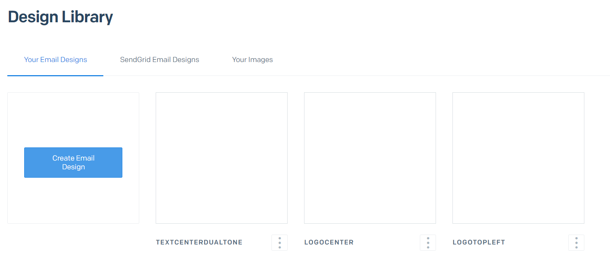
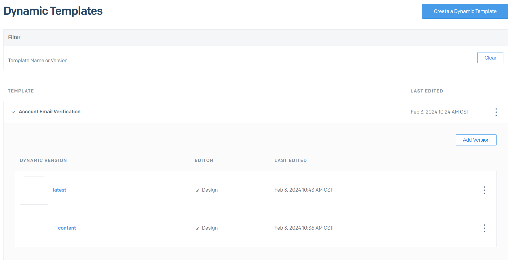

# sendgrid-template-manager

The SendGrid Template Manager communicates with the SendGrid API to manage your Design
Library and Dynamical Templates (a.k.a. Transactional Templates) on the SendGrip website.

## Features

A drawback of SendGrid is that it is easy to create new Templates from a Design,
but a painstaking manual task to apply changes to existing Templates. With this tool you
can automatically synchronize changes to any Design from the Design Library to your
Templates.

## How does it work?

The tool merges the content of a *Template Content Version* (TCV) with a *Design* into a
new *Template Version* on your SendGrid account.

The Design contains your entire email layout (header, footer, ...) and should contain
an **empty** Text module somewhere. This is where the Template Content Version will be
inserted.



Template Content Versions are versions of a Template with the name `__content__`. The
entirety of the TCV will be inserted into the Design.




The result of the merger will be stored in a new/updated version in the same Template.

That's it!


## Installation

You can install SGTM globally:

```
npm install i -g sgtm
sgtm --help
```

or use `npx`:

```
npx sgtm --help
```

## Usage

To use the tool, you have to provide a SendGrid API key. The tool will look for the key
in the `.env` file, or you can pass the `--key` option to any command:

```
sgtm list --key=<SGKEY>
```

### Listing your templates

`sgtm list` lists the currently available Designs and Templates in your account.

```
$> sgtm list                      
√ Found 3 designs
  ➥ [fbf0d3f2-c5c1-4083-9b9f-a3cb672] LogoCenter
  ➥ [75ac4b9a-18e7-4ec4-9829-f3fc744] LogoTopLeft
  ➥ [dee0f2f0-26b5-442c-9212-f63e937] TextCenterDualTone
√ Found 9 templates
  ➥ [d-c15c0e739e864a6a9db693e1806] Account Creation
  ➥ [d-e587825eff6e464b9fb7e1348a9] Account Email Verification
  ➥ [d-1f3cc73c7daa4cfbae7bec842d2] Bank Account Verification
  ➥ [d-525a8ad005ec485aaa7e834fb7e] Campaign Creation
  ➥ [d-706954e4f5c24b2faf428a0f0a7] Contact Us
  ➥ [d-5df163e95c83423eabaa106f9a3] Order Confirmation
  ➥ [d-330a76f224b144d2923cc0fb729] Organization Creation
  ➥ [d-8d8b0ab156f247809138420778e] Organization Email Transfer
  ➥ [d-bfdd861990c347e69f64ffe63fe] Organization Email Verification
```

> [!IMPORTANT]
> Templates without a version named `__content__` will be marked with a '?' and can't be used.

## Applying a design to a template

Use `sgtm apply <design name/id> [... template names/ids]` to apply the design to the given
templates:

```
$> sgtm apply LogoCenter "Organization Creation" "Contact Us"            
√ Prepare 'LogoCenter' design
√ Fetch templates
√ Update templates
  √ [d-330a76f224b144d2923cc0fb729527ea] Organization Creation
  √ [d-706954e4f5c24b2faf428a0f0a752829] Contact Us
```

> [!TIP]
> You can leave off any template arguments to apply the design to all templates

> [!TIP]
> By default this will update/create the template version named `latest`, you can use the
> `--tag` option to change this name.
